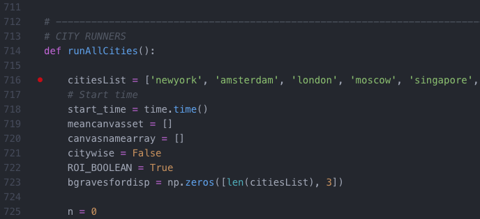

# GlobalColor
A proposed method to determine the mean color of large geographic regions.

colorFinderMulti.py

A process designed to take images of separate cities as an input and output the
average color of the cities. Images are imported using glob and OpenCV libraries.
The image information and associated labels are then stored in Numpy nd arrays
and processed using a combination of Numpy, Scipy, and cv2 tools and finally
visualised using matplotlib.

The goal is really to understand color information received by the human eye
(detailed theory is detailed in separate more detailed documentation) through the
analysis of digital imagery. Theoretically, a color camera seeing what human eyes
see would be the perfect tool for this study and hence the next best thing must
be attempted. This was to mass collect relevant smart phone and camera
data from reliable resources. This considering the smart phone or digital camera
to be the sample swab taking discrete samples of the global color population.

Two initial resources were utilised - Flickr and iPhoto

colorFinderMulti.py is run as a typical python file from terminal. The dependencies have been listed in requirements.txt for the user to pre install.

Additionally the user should modify line 174 as shown below, to whichever is desirable for their image-file-management.

With the current setup this import will pull all images of .jpg format from then
city root folder - 'folder'.

In the 'runAllCities()' function, a list (citiesList) contains the names of All
the cities relevant to the study. Naturally, runAllCities(), will pass all these
strings through the import process to import images relevant to listed city names
in the root import folder.

Start up sequence of colorFinderMulti.py:

All process annotated with print outputs to inform progress:

When fully processed, the algorithm will plot all images of each city:

Additionally a plot of all images means will be shown (small tiles representing
    the mean color of each image)

Finally, a 3 space plot will be shown, a 3 dimensional cartesian co-ordinate DataFrame
with B, G, R being represented on X, Y, Z axis respectively. Each image has between
plotten in this co-ordinate frame corresponding to the BGR value of its mean color.

The aim here is to visually represent any apparent clustering in the data.

Shephard: Means of collecting image data for the study.
